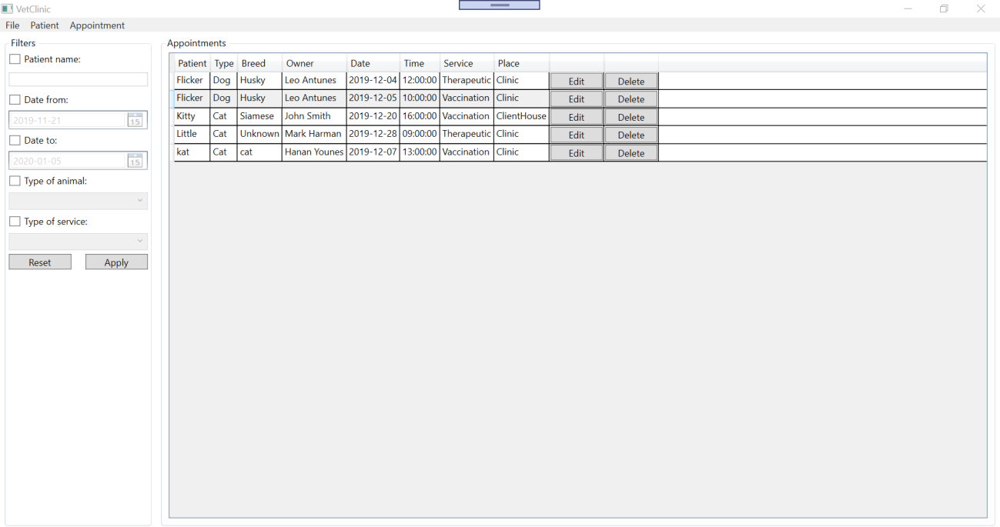
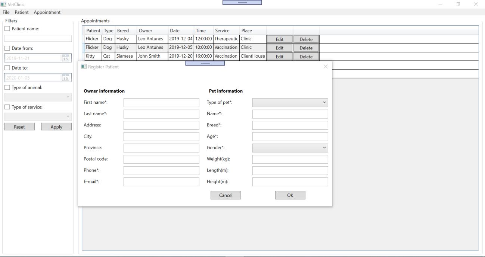
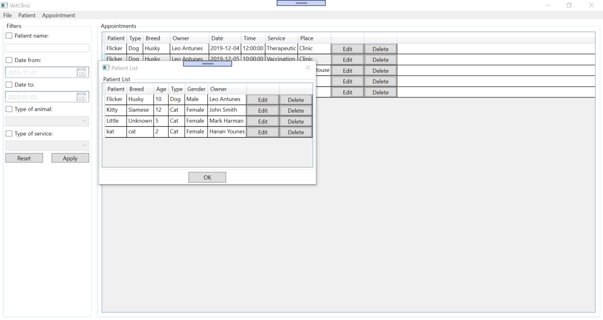
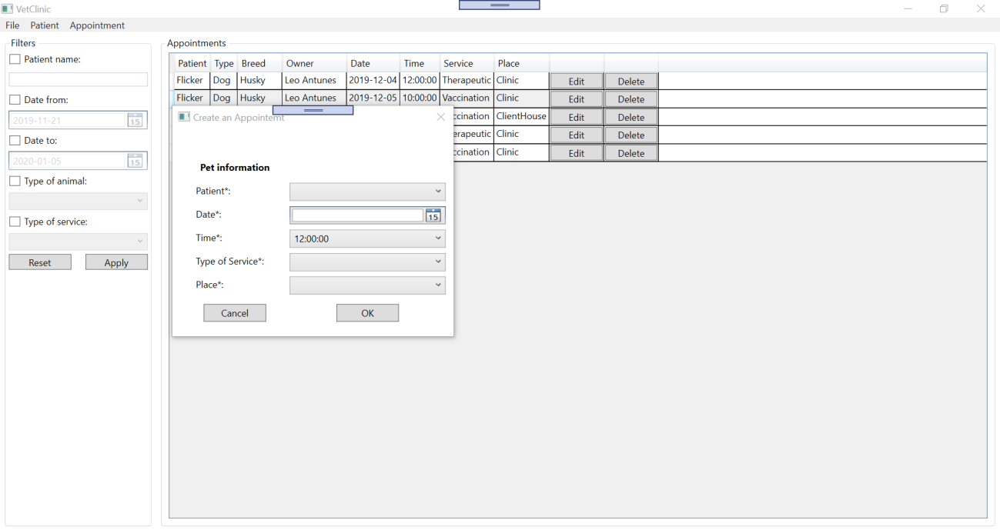
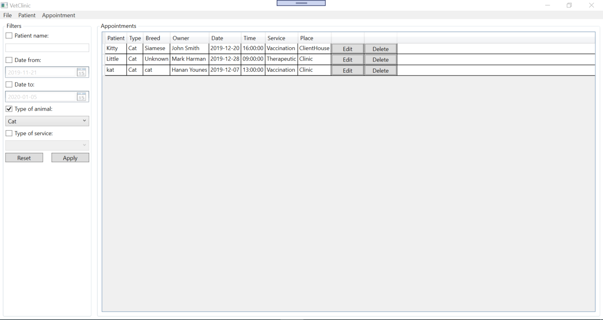

# VetClinic
The Vet Clinic software is a Windows Presentation Foundation product that aims to help veterinarian clinics with their daily appointment bookings and patients’ registration. The product allows any clinic to register different kinds of animals based on their own preferences. 

The application offers book an appointment functionality; appointments can be either at the clinic or at the client's house depending on the animal needing help. The product offers a selection of services than can be either therapeutic, surgery, or vaccination. In addition, the software provides search feature that allows intended users to search for appointments for a specific day or any appointment for a specific animal.

### User Interface Design (Main Window)
The user interface of the VetClinic application has a main window that is divided into four sections. These sections provide different functionalities as per the project requirements.
- **Input:** the VetClinic application offers data input at the top left-side of the main window with two options, Patient Menu and Appointment. The Patient Menu option allows end users to enter new pet-owner information by selecting the Add button or edit/delete existing patient from the patient list by selecting the Manage button. Meanwhile, the Appointment option creates a new appointment for any of the existing patients with their intended service and at their convenient place. All data input options open as a new window or a dialogue box on top of the main window.
- **List:** this section shows a list of available appointments on the right-hand side of the main window. A data grid is used to display information that has been given through the different input options.
- **Save and Retrieve Data:** users can load, save, and delete data from patient and appointment list by selecting Load, Save or Clear buttons from the File dropdown menu. Data is saved and retrieved from an XML file.
- **Search:** The application enables users to search through the data currently displayed and saved in lists using a set of filters, including pet name, date range, type of service, and type of animal. The search results represent only a subset of the full saved patients/appointments’ lists.

### Code Design Pattern
The VetClinic application is designed to take full advantage of the Model-View-ViewModel (MVVM) design pattern, which would result in more readable and clear code. The MVVM pattern is divided into three sections.

#### View
This section includes all of the user interface elements of the application that the intended users would mainly with. A wide selection of input controls has been used to help users perform a variety of tasks related to patients and appointments, including but not limited to combo boxes, buttons, checkboxes, textboxes etc. All of these UI elements are placed in four windows that are all XAML files:
- **MainWindowView:** this is the application’s home screen and main point of interaction for users.
- **AppointmentDialogView:** this view is a pop-up dialog that allows users to create a new appointment to one of the registered patients. Users can create new appointment by clicking on Add button under Appointment tab.
- **PatientDialogView:** this view is a pop-up dialog that offers adding a new pet/owner information to the patient list. Users can add a new patient by clicking on Add button under Patient tab.
- **PatientListDialogView:** this view is a pop-up dialog that offers modifying or deleting an existing patient information from the patient list. Users can edit or delete a patient by clicking on Manage button under Patient tab.

#### ViewModel
This section includes all of the objects that provide data, business logic, and functionality for each view in the view section listed above. The ViewModel is acting as a connection between the View, which faces users, and the Model, which models the business rules. Similarly, there are four view model classes that have a direct mapping with their prospective view through binding.
- **MainWindowViewModel:** this is the main ViewModel that provides most of the data and functionality to the Vet Clinic’s MainWindowView including saving, loading and clearing data from all lists.
- **AppointmentDialogViewModel:** this ViewModel is mapped to the AppointmentDialogView to provide appointment related data, and help users to create a new appointment to one of the registered patients based on available time slots, length of one time slot and place of service. The number of time slots available, the start of the first appointment, and the length of one slot are customizable.
- **PatientDialogViewModel:** this ViewModel is mapped to the PatientDialogView to facilitate the functionality of adding new patient/owner information to the patient list.
- **PatientListDialogViewModel:** this ViewModel is binded to PatientListDialogView that is mainly concerned about modifying or deleting an existing patient information from the patient list.

#### Model
This section includes all of the application’s custom classes, enums, and all necessary generic collections. It is data centric Classes used are as follows:
- **Person Class:** includes all pet owner properties.
- **Pet Class:** includes all patient/pet related properties and to connect a pet to a specific person object (owner).
- **Appointment Class:** includes all appointment properties.
- **Schedule Class:** to create a schedule based on available appointments in the list.
- **Clinic Class:** this class handles daily schedule based on the appointment list and registered patients based on the patients’ list.

In addition to these main classes, the application makes use of other classes/enumerations that facilitate certain functionalities, which are customizable, as follows:
- **AppointmentFilter Class:** to set and reset search filters.
- **AppointmentPlace Enum:** to specify a list of possible appointment places.
- **Gender Enum:** to specify a list of pets’ genders.
- **PetType Enum:** to specify a list of pet types accepted at the clinic.
- **ServiceType Enum:** to specify a list of available services.

### Core
In addition to the MVVM pattern and sections explained above, the VetClinic application is offering a notification system (property changed notifications) that is achieved by implementing the INotifyPropertyChanged Interface. By doing so, binding clients are notified when a property value has changed.

## Screenshots:
i. Main application window:

ii. Add a new patient:

iii. Manage an existing patient:

iv. Create a new appointment:

v. Filter the appointment list using the type of animal filter:

